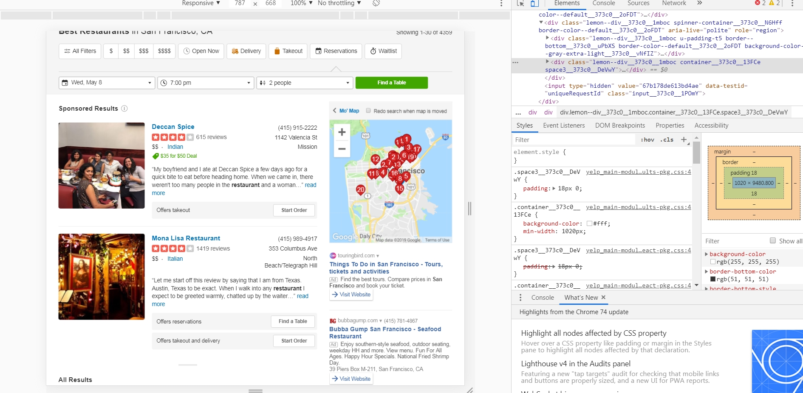
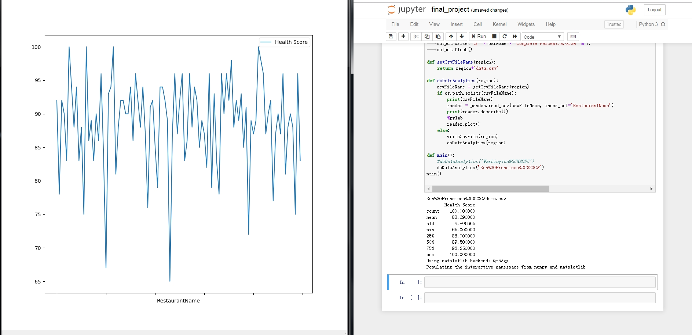
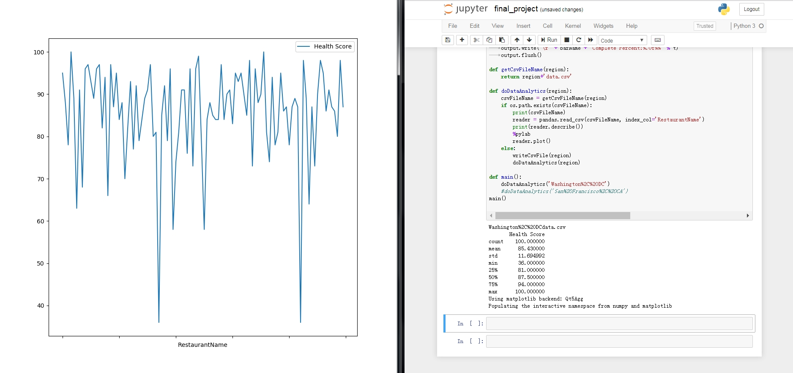

# Application for scraping Data from yelp's website, storing the data into the csv file and doing a Data Analytics

## Step1: Doing a general Inspection of Yelp'S website

### Step1: Doing a scraping 
      # Defining a method to get Yelp main website's html contents about the restaurant in one specific region
      def getYelpHtmlContent(region, pageNum):
        yelpURL = 'https://www.yelp.com/search?find_desc=Restaurants&find_loc=' + region + '&start=' + str(pageNum)
        yelpPageContent = requests.get(yelpURL).text
        return yelpPageContent

      # Defining a method to get general website's html contents by inputting the URL
      def getHtmlContent(URL):
        restaurantContent = requests.get(URL).text
        return restaurantContent

      # Defining a method to get each restaurant main page's Url and storing it into the restaurantPageUrlList
      def getRestaurantMainPageUrlList(region):
        k = 0
        # Declaring a list to store the restaurant page Url
        restaurantPageUrlList = []
        pageNum = 0
        while pageNum < 30:
          # Getting the Yelp page's Content
          pageHtmlContent = getYelpHtmlContent(region, pageNum)
          # Using BeautifulSoup to get html tag of the restaurant's url
          soup = BeautifulSoup(pageHtmlContent, 'html.parser')
          cssClassName = 'lemon--a__373c0__IEZFH link__373c0__29943 photo-box-link__373c0__1AvT5 link-color--blue-dark__373c0__1mhJo link-size--default__373c0__1skgq'
          restaurantPageUrlResult = soup.find_all("a", class_=cssClassName)
          for n in restaurantPageUrlResult:
            if n['href'][1] == 'b':
              restaurantFullUrl = 'https://www.yelp.com' + n['href']
              restaurantPageUrlList.append(restaurantFullUrl)
              k = k + 1
              print('Yelp:' + str(k))
          pageNum = pageNum + 30
        print(restaurantPageUrlList)
        return restaurantPageUrlList

      # Defining a method to get each restaurant Health Score page's Url and storing it into the healthScoreUrlList
      def getRestaurantHealthScoreURLList(region):
        restaurantPageUrlList = getRestaurantMainPageUrlList(region)
        # Declaring a list to store the restaurant Health Score page Url
        healthScoreUrlList = []
        # Using for loop to get Health Score of each restaurant's Url
        restaurantNum = 0
        for n in restaurantPageUrlList:
          if (restaurantNum < 5):
            # Getting the restaurant page content
            restaurantPageUrl = n
            restaurantPageContent = getHtmlContent(restaurantPageUrl)
            # Using the BeautifulSoup to get html tag of the url of restaurant Health Score page
            soup = BeautifulSoup(restaurantPageContent, 'html.parser')
            restaurantHealthScoreCssClassName = 'health-score-info'
            findHealthScorePageUrl = soup.find_all(class_=restaurantHealthScoreCssClassName)
            # Storing the 100 url of restaurant Health Score page into healthScoreUrlList
            for h in findHealthScorePageUrl:
              healthScorePageUrl = 'https://www.yelp.com' + h.b.a['href']
              healthScoreUrlList.append(healthScorePageUrl)

              restaurantNum = restaurantNum + 1
              print('countHealth' + str(restaurantNum))

        print(healthScoreUrlList)
        return healthScoreUrlList

      # Defining a method to get the Name and Health Score of each restaurant
      def getDataOfHealthScorePage(region):
        healthScoreUrlList = getRestaurantHealthScoreURLList(region)
        # Creating a restaurantDataList to store all the restaurant information
        restaurantDataList = []
        # Connect to the Health Score page and get the Name and Health Score
        for n in healthScoreUrlList:
          # Creating a dict to store the Name and Health Score of each restaurant
          restaurantInfoDict = {}
          # Getting the Health Score page content
          healthScoreContent = getHtmlContent(n)
          soup = BeautifulSoup(healthScoreContent, 'html.parser')
          # Using the BeautifulSoup to get the html tag of the restaurant Name
          resultName = soup.find_all('a', class_="biz-name js-analytics-click")
          # Storing the Name into the restaurantInfoDict
          for rn in resultName:
            restaurantInfoDict['RestaurantName'] = rn.span.string
          # Storing the Score into the restaurantInfoDict
          resultScore = soup.find_all('span', class_='score')
          for rs in resultScore:
            restaurantInfoDict['Health Score'] = rs.string
          # Adding the each restaurant's restaurantInfoDict into restaurantDataList
          restaurantDataList.append(restaurantInfoDict)
        print(restaurantDataList)
        return restaurantDataList
        
### Step2: Saving as csv file
        def writeCsvFile(region):
          restaurantDataList = getDataOfHealthScorePage(region)
          fileName = region + 'data.csv'
          with open(fileName, 'w', newline='', encoding='utf-8') as csvFile:
            fields = ['RestaurantName', 'Health Score']
            writer = csv.DictWriter(csvFile, fieldnames=fields)
            writer.writeheader()
            writer.writerows(restaurantDataList)
            csvFile.close()

### Step3: Doing an Data Analyticd
        def getCsvFileName(region):
            return region+'data.csv'

        def doDataAnalytics(region):
            csvFileName = getCsvFileName(region)
            if os.path.exists(csvFileName):
                print(csvFileName)
                reader = pandas.read_csv(csvFileName, index_col='RestaurantName')
                print(reader.describe())
                %pylab
                reader.plot()
            else:
                writeCsvFile(region)
                doDataAnalytics(region)

### RESULT San Francisco, CA:

### Result Washington, DC:

